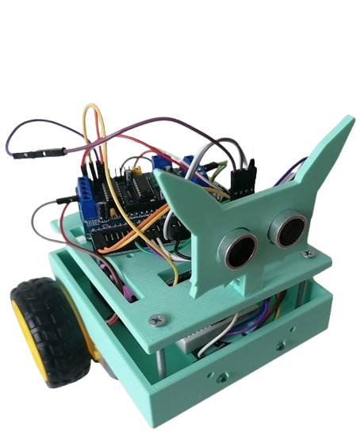

# Arduino Bluetooth Car 

In this school project I made a bluetooth controlled robot using Arduino. 
Usually, remote-controlled robots are controlled by RC remotes, but I chose an android phone.
For this project, I also created a case with a 3D printer and designed it in OpenScad program.

Parts of the 3D case:
* head.stl
* upper_part.stl
* lower_part.stl

A 3D robot with some parts can be seen in Bluetooth_robot_with_all_parts.stl.
To write and upload code to the Arduino boards is used Arduino IDE program (variant of the C++ programming language).

### List of hardware components:
* [Arduino UNO (board)](https://techfun.sk/produkt/arduino-uno-smd-edicia-precizny-klon/)
* [Motor driver shield](https://techfun.sk/produkt/motor-driver-shield-l293d/)
* [2 - DC Motors with Wheels](https://techfun.sk/produkt/dc-motorcek-pneumatika/)
* [Smart car wheel (passive)](https://techfun.sk/produkt/otocne-koliesko-pre-stavebnice-auticok/)
* [HC-06 Bluetooth Module](https://techfun.sk/produkt/bluetooth-modul-hc-06-slave/)
* 2 - Li-ion Batteries OR 9V Battery
* [Switcher](https://techfun.sk/produkt/jednoduchy-prepinac/)
* Jumper wires (various types)
* Double sided tape or glue, screws, screwdriver

#### Optional:
* [2 - LED RGB modules](https://techfun.sk/produkt/led-rgb-modul/) OR 2 - RGB led + 6 - rezistor (3 for 1 led)
* [PCB](https://techfun.sk/produkt/nepajive-pole-170-bodov/)
* [Ultrasonic sensor](https://techfun.sk/produkt/ultrazvukovy-senzor-vzdialenosti-hy-srf05/)
* [Buzzer](https://techfun.sk/produkt/pasivny-buzzer-samostatne/)

### Step 1
Soldering wires to motors and attaching it under the lower part of case with tape or glue.
Connecting wheels to robot. 

### Step 2
Connecting Arduino Uno and motor driver shield together. Then placing it on upper part of case.

### Step 3
Mounting the battery pack + soldering wires to switcher, attaching it in the lower part of case.

### Step 4
Mounting the HC-06 module.

#### Optional step
*Mounting led RGB modules, ultrasonic sensor and buzzer via board to motor shield.
Ultrasonic sensor belongs to the head part of case, the other components to the lower part.*

### Step 5
Connection of all components according to the wiring diagram. (wiring_diagram.png)

### Step 6
Programming the Arduino Uno board with Arduino IDE.

### Step 7
Downloading the Android App from Google Play Store.
* [Bluetooth RC Car (suggestion)](https://play.google.com/store/apps/details?id=braulio.calle.bluetoothRCcontroller)

### Step 8
Code

*Note: Before uploading the sketch on the Uno board, it is neccesary to remove two jumper wires that is connected to the TX and RX pin of Arduino. Otherwise Arduino IDE gives us a programming error. After successfully uploading the sketch, connect the two wires (TX and RX) on their places.*

  

